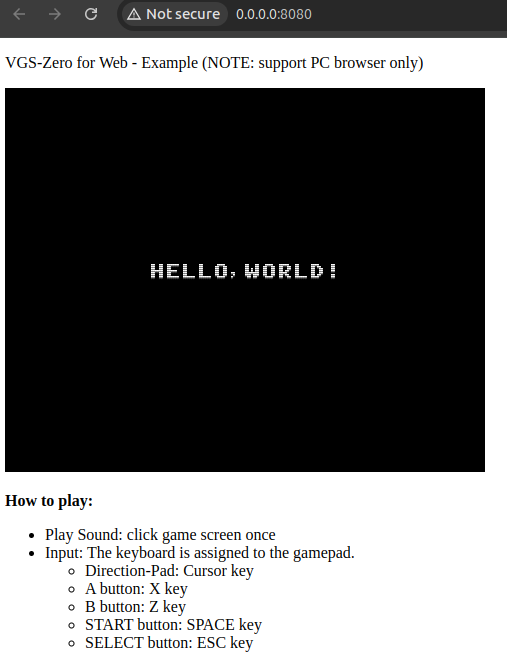

# VGS-Zero for Web Browser

VGS-Zero のゲームをブラウザ上で動かすことができます。



Check the [demonstration web app (Battle Marine)](https://battle-marine.web.app/).

## Recommended Usage

- 例えばゲームの体験版を配布する時、ブラウザ版を配布することでユーザにインストールの手間を取らせることなくゲームを遊んでいただくことができます。
- 他にも AdSense を用いて広告でマネタイズするカジュアルゲームなどでも有用かもしれません。
- スマートフォンのブラウザでも（操作にはバーチャルパッド等が必要になりますが）正常に動作します。

> ただし、NSF ファイルを再生することはできません。（ブラウザ対応する場合、音楽は VGS で作成してください）

## How to Build

ビルドには Ubuntu Linux が必要です。

> UI は不要なので Windows の場合 WSL2 等でも問題無いかもしれません。

```bash
# 必要なミドルウェアをインストール
sudo apt update
sudo apt install build-essential python3

# リポジトリをダウンロード
git clone https://github.com/suzukiplan/vgszero-web
cd vgszero-web

# サブモジュール初期化
git submodule init update

# emscripten をインストール
# 注意: apk install でインストールしたものだと正常に動作しませんでした（謎）
#      submodule で追加している emsdk からインストールすれば正常に動作します。
cd emsdk
./emsdk install latest
./emsdk activate latest

# emscripten の環境変数を設定
source ./emsdk_env.sh
cd ..

# ビルド
make
```

正常にビルドが完了すると python の http サーバで [./public](./public/) ディレクトリをホストします。

```bash
$ make
./tools/bin2var/bin2var game.pkg GAMEPKG > src/gamepkg.h
emcc ./src/vgsweb.cpp ./src/BufferQueue.cpp ./vgszero/src/core/vgs0math.c ./vgszero/src/core/vgstone.c ./vgszero/src/core/nsf/xgm/devices/Sound/rom_tndtable.c ./vgszero/src/core/nsf/xgm/player/nsf/nsf.cpp ./vgszero/src/core/nsf/xgm/devices/CPU/nes_cpu.cpp ./vgszero/src/core/nsf/xgm/devices/Sound/nes_vrc6.cpp ./vgszero/src/core/nsf/xgm/devices/Sound/nes_apu.cpp ./vgszero/src/core/nsf/xgm/devices/Sound/nes_dmc.cpp ./vgszero/src/core/nsf/xgm/devices/Memory/nsf2_vectors.cpp ./vgszero/src/core/nsf/xgm/devices/Memory/nes_bank.cpp ./vgszero/src/core/nsf/xgm/devices/Memory/nes_mem.cpp ./vgszero/src/core/nsf/xgm/devices/Misc/nsf2_irq.cpp ./vgszero/src/core/nsf/xgm/devices/Audio/rconv.cpp -s WASM=1 -s USE_SDL=2 -O3 -o public/index.js
cd public && python -m http.server 8080
Serving HTTP on 0.0.0.0 port 8080 (http://0.0.0.0:8080/) ...
```

ブラウザで [http://0.0.0.0:8080/](http://0.0.0.0:8080/) へアクセスすればゲームの起動を確認できます。

## How to Deploy

- [./game.pkg](./game.pkg) ファイルをあなたのゲームに差し替えてビルドしてください
- [./public](./public/) ディレクトリを [Firebase Hosting](https://firebase.google.com/docs/hosting?hl=ja) 等でホスティングすれば、全世界にあなたのゲームを公開できます

## License

[GPLv3](./LICENSE.txt)
